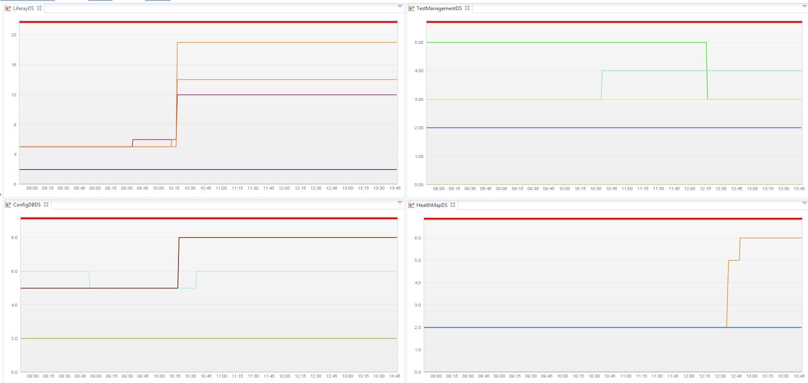

## JBoss 7 Datasource Monitoring Plugin

Starting "Jboss 7" or "Jboss EAP 6", Jboss has stopped the support for exposing connection pool statistics via JMX beans. If you want to use the dynaTrace JMX based measure to monitor your datasource
usage/statistics you wont be able to do so.

By default Jboss will only listen on the localhost interface. You probably want to change that setting. In the standalone/configuration/standalone.xml file, look for this line:

	     <inet-address value="${jboss.bind.address.management:127.0.0.1}"/>

You will want to remove that line (or comment out that line.)

Add this line:
 
         <any-address/>

Then re-start the Jboss instance.

You will also have to create a "Management User" account. To do so,
run the add-user.sh script in the bin directory.

If you open http://myserver:9990 and you get an error, then you need to double check the port 

This plugin will help you capture the datasource statistics in "Jboss 7" or "Jboss EAP 6" using the new REST based Jboss management console. 

For more info, see [Jboss Docs for HTTP Management API](https://docs.jboss.org/author/display/AS71/The+HTTP+management+API)

Once you capture the measure you can chart on the data.

Here is a screen shot of a dashboard, which monitors the active Connection on individual data-sources.

Find further information in the [dynaTrace community](https://community.compuwareapm.com/community/display/DL/JBoss+7+Datasource+Monitoring+Plugin)